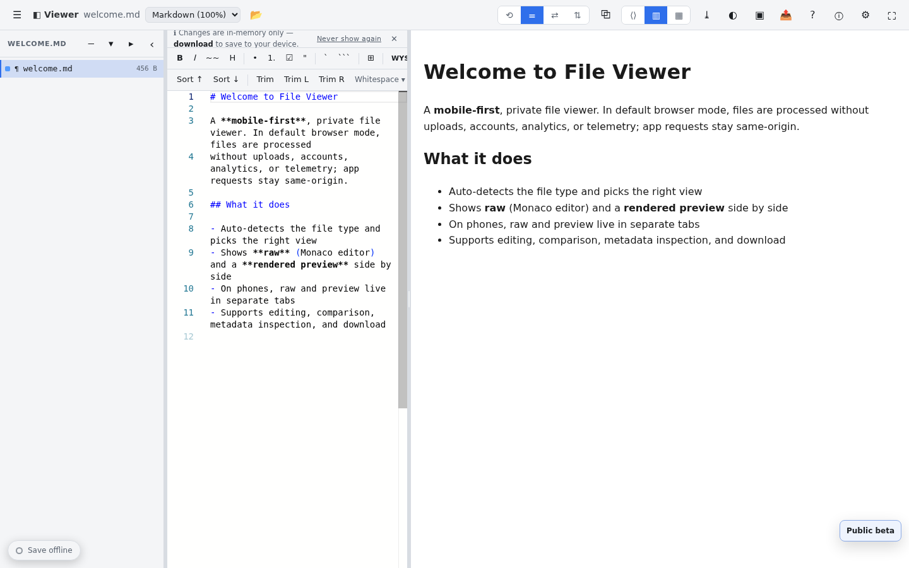
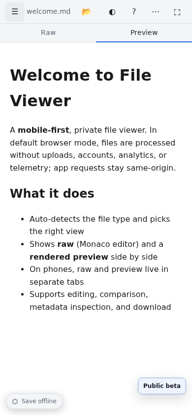

# File Viewer

**v0.1.0 Public beta**

File Viewer is a private, browser-based file workbench for opening, inspecting, comparing, and editing files without first sending them to a hosted service.

**[Open File Viewer](https://jdeworks.github.io/file-viewer/)**





## Why File Viewer

Open a file, a folder, or pasted text in a browser workspace that adapts to the content. Read source beside a rendered preview, inspect metadata, make an edit, compare revisions, and download the result. On phones, source and preview remain usable as separate tabs.

The public beta is for people who need a practical local-first viewer before reaching for a desktop application, an upload site, or a one-off conversion tool.

## Privacy and network modes

File Viewer has different network behavior depending on the mode you choose:

| Mode | What to expect |
| --- | --- |
| Browser mode (default) | By default, app requests stay on the app's own origin. The normal browser workflow is designed without file uploads, accounts, analytics, telemetry, or runtime CDN dependencies. |
| Documents with external resources | A file can reference remote images, media, fonts, or links. Preview behavior varies by format; an allowed resource can make a browser request to its referenced origin. Markdown remote images are shown without loading them by default. |
| Confirmed script-enabled HTML | HTML previews are sanitized by default. If you explicitly confirm that a document's scripts may run, that document can make network requests according to its own code. |
| Optional Companion | The desktop Companion is opt-in. When enabled, the browser exchanges selected file paths and bytes with its local service at `127.0.0.1` for watched-folder workflows and save-back. |

Browser developer tools remain the best way to inspect requests for your browser, deployment, and selected file. The viewer is designed so ordinary file handling stays in the tab; external references are not the same as uploading the opened file, but they can still disclose normal request metadata to their destination.

## Everyday workflows

- Open individual files, folders, drag-and-drop content, or paste text.
- Read raw source, a rendered preview, or both side by side; use mobile tabs when space is tight.
- Edit supported text formats, format documents, and download your changes.
- Compare original and current content with standard or move-aware diffs.
- Browse a folder tree, inspect file metadata, search content, and export edited work.
- Capture supported rendered previews as PNGs.

## Formats

File Viewer currently covers **140+ base types** plus hundreds of recognized developer/config files. Detection is intentionally broad, while rendering depth varies by format and browser.

Curated categories include:

- Documents and books: Markdown, HTML, PDF, EPUB, FB2, DOCX, ODT, PPTX, and RTF.
- Data and structured text: JSON, CSV, YAML, TOML, XML, INI, SQL, GeoJSON, GPX, calendars, and contacts.
- Code and configuration: common source languages plus project, editor, CI, package-manager, infrastructure, and operating-system configuration files.
- Media and images: common raster, vector, audio, video, subtitle, and font formats.
- Office, archives, binaries, 3D, and scientific formats: spreadsheets, presentations, ZIP-family containers, SQLite, 3D models, and selected specialist files.

Use the built-in examples to see the current presentation for a specific format. Some advanced formats and codecs depend on the browser and may offer inspection or download rather than a complete preview.

## Offline use

No installation is required. File Viewer uses a browser-mode web app manifest and a service worker, not an install-first application flow.

- **Cache on use:** assets fetched while you work can remain available for later offline use.
- **Save offline bundles:** choose bundles from the in-app **Save offline** control when you want a more deliberate offline set.
- **Optional heavy packages:** larger viewers and examples are selectable, so a full offline bundle does not have to be the starting point.

An offline preview can be unavailable when its renderer was not previously cached. Reconnect once, open the needed feature, or save an appropriate offline bundle before going offline.

## Optional Companion

The browser app is useful on its own. The optional [Companion](companion/README.md) adds local watched folders, save-back, file-change watching, and native folder selection where supported. It runs a local service on `127.0.0.1` and requires an explicit browser opt-in.

Release builds may be unsigned while the project establishes its distribution process. Treat operating-system and browser warnings as a prompt to verify the release source and checksum; checksums help verify downloaded bytes, but do not establish publisher identity. See [Releases](https://github.com/jdeworks/file-viewer/releases) for published artifacts and [Issues](https://github.com/jdeworks/file-viewer/issues) for beta feedback.

## Beta notes

Core workflows are ready for broad testing; advanced format support is still improving. Please report a reproducible file type, browser/version, and expected versus observed behavior in [Issues](https://github.com/jdeworks/file-viewer/issues).

- Automated coverage targets Chromium. Firefox and Safari are best-effort targets.
- Media codecs and advanced-format behavior can vary by browser, operating system, and available decoding support.
- Non-media files over 64 MiB are read as a bounded head for browsing instead of fully loaded into memory. Formats that require the complete file may not render from that bounded head. Large audio and video may stream from the browser's file handle instead.

## Develop

File Viewer is a static client application served from `docs/`:

```sh
cd docs
python3 -m http.server 8000
# http://localhost:8000
```

Core orchestration lives in `docs/core/`; file-type modules live in `docs/types/<id>/`; runtime libraries are vendored in `docs/vendor/`. To add a type, create its module folder and register it in `docs/core/registry.js`. Keep runtime dependencies local to the repository rather than adding a CDN.

## Test

```sh
node tests/movediff.test.mjs
node tests/smoke.mjs
./scripts/check.sh
```

The smoke test serves the app and drives Chromium while checking for unexpected off-origin requests in the default browser mode.

## License

[MIT](LICENSE). Vendored packages retain their own licenses; pinned versions are recorded in
[`docs/vendor/VERSIONS.json`](docs/vendor/VERSIONS.json).
